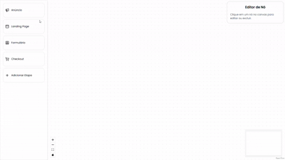

# 🚀 Funnel Builder

Aplicação web para criação visual de funis de campanhas de tráfego pago.

O usuário pode montar etapas do funil (como anúncio, landing page, formulário e checkout), conectá-las entre si e visualizar o fluxo completo com dados simulados.

---

## 🎥 Demonstração


[](https://drive.google.com/file/d/1zwh115Iyq2v2iREr3BeLH5uiP7gMC9IM/view?usp=sharing)

Demonstração Completa: [Demo.mp4](https://drive.google.com/file/d/1zwh115Iyq2v2iREr3BeLH5uiP7gMC9IM/view?usp=sharing)

---

## ✨ Funcionalidades

* Criar etapas do funil dinamicamente
* Conectar etapas entre si
* Visualizar fluxo completo
* Editar dados de cada etapa
* Persistência no navegador (localStorage)
* Interface intuitiva e responsiva

---

## 🧠 Decisões Técnicas

* Uso de React Flow para construção visual do fluxo
* Zustand para gerenciamento de estado global
* Separação clara entre:

  * lógica (store)
  * UI (components)
* Estrutura modular para facilitar escalabilidade

---

## 🛠️ Tecnologias

* Next.js (App Router)
* React
* React Flow
* Zustand
* shadcn/ui
* Tailwind CSS

---

## 📂 Estrutura do Projeto

```
components/
  flow/       # Canvas, nodes e controles
  sidebar/    # Painéis de criação e edição

store/
  # Estado global com Zustand

lib/
  # Utils e constantes
```

---

## ▶️ Como rodar o projeto

```bash
npm install
npm run dev
```

---

## 🚀 Deploy

A aplicação foi publicada usando:

* Vercel
* Acesse: https://funnel-builder-nextjs.vercel.app/

---

## 📌 Observações

* Os dados são simulados (não há backend)
* O foco do projeto é a experiência do usuário e organização do código

---

## 👨‍💻 Autor

Arthur Alonso Marcelino Domingos

